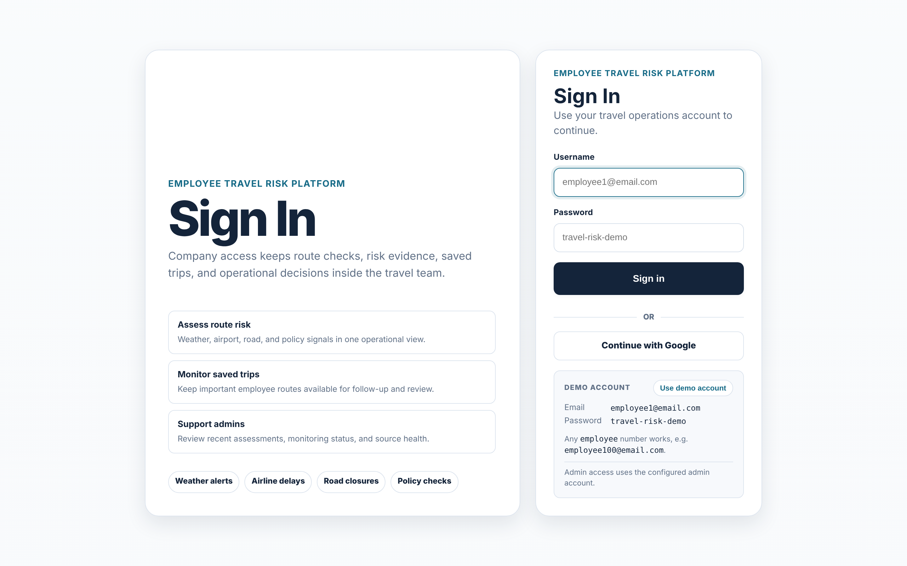
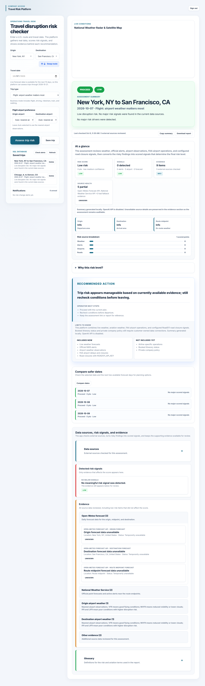
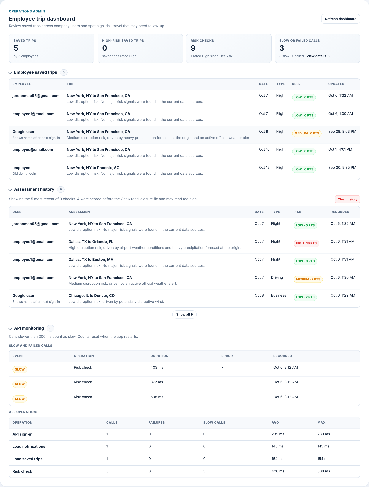

# Travel Risk Platform

Spring Boot version of the travel disruption risk app. It serves the existing dashboard UI and exposes the same `/api/analyze` contract from a Java backend.

## Production Application

- Live app: [https://travel-risk-platform.onrender.com](https://travel-risk-platform.onrender.com)
- Login page: [https://travel-risk-platform.onrender.com/login](https://travel-risk-platform.onrender.com/login)
- Employee demo logins: any `employee` plus a number at `email.com`, such as `employee1@email.com`, `employee5@email.com`, or `employee100@email.com` / `travel-risk-demo` (or click **Use demo account** on the login page)
- Admin login: set `TRAVEL_RISK_ADMIN_USERNAME` and `TRAVEL_RISK_ADMIN_PASSWORD`

The production deployment runs on Render with a managed Render Postgres database. Saved trips are persisted in the `saved_trips` table, and risk-change notifications are persisted in the `trip_notifications` table.

## Screenshots

### Login



### Risk Result



### Admin Dashboard



## Run Locally

```bash
mvn spring-boot:run
```

Then open `http://localhost:8080`.

## Health Check And CI

- Health check: `GET /health` returns `{"status":"UP"}` and is used by Render.
- CI: GitHub Actions runs `mvn test` on every branch push and pull request.

## Optional AI Summary

The platform works without an OpenAI key by using a local summary fallback. To enable OpenAI-generated summaries:

```bash
export OPENAI_API_KEY=your_key_here
export OPENAI_MODEL=gpt-6-astra
```

## Authentication

The dashboard is protected by Spring Security. Employee users can only see their own saved trips and notifications. Admin users can also see the company-wide dashboard, assessment history, and API monitoring views.

For local demos, sign in as an employee with any `employee` plus a number at `email.com`, such as `employee1@email.com`, `employee5@email.com`, or `employee100@email.com` / `travel-risk-demo`. The **Use demo account** button on the login page fills these in for you. Configure an admin account with:

```bash
export TRAVEL_RISK_EMPLOYEE_USERNAME_PATTERN='employee[0-9]+@email\.com'
export TRAVEL_RISK_PASSWORD=your-password
export TRAVEL_RISK_ADMIN_USERNAME=your-admin-user
export TRAVEL_RISK_ADMIN_PASSWORD=your-strong-admin-password
export TRAVEL_RISK_JWT_SECRET=replace-with-at-least-32-characters
```

API clients can request a JWT:

```bash
curl -X POST http://localhost:8080/api/auth/token \
  -H "Content-Type: application/json" \
  -d '{"username":"employee1@email.com","password":"travel-risk-demo"}'
```

Then call protected endpoints with `Authorization: Bearer <token>`.

OAuth2 login is supported through Google. Create a Google OAuth client for a web application and add this redirect URI:

```text
http://localhost:8080/login/oauth2/code/google
```

Then create a local `.env` file:

```properties
GOOGLE_CLIENT_ID=your-google-client-id
GOOGLE_CLIENT_SECRET=your-google-client-secret
```

The `.env` file is ignored by Git. Start the app with:

```bash
mvn spring-boot:run
```

The login page will use `/oauth2/authorization/google` for Google sign-in.

## Admin Dashboard

**Access:** set `TRAVEL_RISK_ADMIN_USERNAME` and `TRAVEL_RISK_ADMIN_PASSWORD` (both are required; changes apply on restart), then sign in with those credentials on `/login`. The dashboard appears on the main page only for that account. Employee and Google sign-ins never see it, and `/api/admin/**` returns `403` for them.

**What it shows** (`GET /api/admin/dashboard`):

- Four totals: saved trips (and how many employees saved them), high-risk saved trips, risk checks (and how many rated High since the Oct 6 scoring fix), and slow or failed API calls. Click the last one to jump to the details.
- Every employee's saved trips, ordered by travel date. Employees show by name or email; Google accounts show their name after their next sign-in.
- The 50 most recent risk checks across all users (5 shown until you click **Show all**). Checks recorded before the Oct 6 road-closure fix are marked, since their scores can read too high. **Clear history** (`DELETE /api/admin/assessment-history`) asks for confirmation, then deletes all of them and can't be undone.
- API monitoring: one row per API endpoint with friendly names (Risk check, Load saved trips, ...), with call counts, failures and slow calls (at or above `SLOW_API_THRESHOLD_MS`, default 1500 ms), plus the last 25 slow or failed calls. These counters are in memory and reset on restart.

Each section can be collapsed, and the browser remembers which ones you closed.

## Error Responses

Every API error returns the same JSON shape with an HTTP status code:

```json
{ "error": "Origin is required. Date is required." }
```

`400` means invalid input, `401` not signed in, `403` not an admin, `404` the saved trip or notification doesn't exist, `429` rate limited, and `500` an unexpected server error (details go to the server log, not the response).

## Rate Limiting

In-process, fixed-window rate limiting protects two endpoints. Over the limit, the API returns `429` with a `Retry-After` header (seconds) and `{"error": "..."}`, and the request never reaches the controller.

- `GET /api/analyze`: per authenticated user (JWT subject / session user); falls back to client IP when unauthenticated.
- `POST /api/auth/token`: per client IP, stricter, to slow down password guessing.

| Property (env var) | Default | Meaning |
| --- | --- | --- |
| `travel-risk.rate-limit.enabled` (`RATE_LIMIT_ENABLED`) | `true` | Set `false` to disable rate limiting entirely |
| `travel-risk.rate-limit.analyze.requests` (`RATE_LIMIT_ANALYZE_REQUESTS`) | `30` | Analyze requests allowed per window |
| `travel-risk.rate-limit.analyze.window` (`RATE_LIMIT_ANALYZE_WINDOW`) | `60s` | Analyze window length (e.g. `60s`, `2m`) |
| `travel-risk.rate-limit.token.requests` (`RATE_LIMIT_TOKEN_REQUESTS`) | `10` | Token requests allowed per IP per window |
| `travel-risk.rate-limit.token.window` (`RATE_LIMIT_TOKEN_WINDOW`) | `60s` | Token window length |

Counters are kept in memory per application instance and reset on restart. Behind a reverse proxy (such as Render), set `server.forward-headers-strategy=native` so the client IP is taken from `X-Forwarded-For` instead of the proxy address.

## Redis Cache

Repeated trip assessments are cached through Spring Cache. Local development uses the in-memory cache by default. To use Redis, run Redis locally or in production and start the app with:

```bash
export SPRING_CACHE_TYPE=redis
export REDIS_HOST=localhost
export REDIS_PORT=6379
export REDIS_CACHE_TTL=10m
mvn spring-boot:run
```

Cache behavior:

- `GET /api/analyze` uses `@Cacheable` to reuse matching route/date assessments.
- `POST /api/analyze/cache/refresh` uses `@CachePut` to recompute and replace one cached assessment.
- `DELETE /api/analyze/cache` uses `@CacheEvict` to remove one cached assessment.

## SQL Saved Trips

Saved trips are stored in SQL through Spring Data JPA and Flyway migrations. Local development uses an H2 database file at `./data/travel-risk` by default, while production should use a managed Postgres database.

The included `render.yaml` creates a Render Postgres database named `travel-risk-platform-db` and passes its connection string to the web service as `DATABASE_URL`. The Docker entrypoint converts Render's `postgresql://...` URL into the JDBC settings Spring Boot expects.

To connect Postgres, set JDBC environment variables before starting the app:

```bash
export JDBC_DATABASE_URL=jdbc:postgresql://host:5432/travelrisk
export JDBC_DATABASE_USERNAME=travelrisk
export JDBC_DATABASE_PASSWORD=your-password
export JPA_DDL_AUTO=validate
mvn spring-boot:run
```

Flyway creates the `saved_trips` table on first startup. Hibernate then validates the schema instead of changing it at runtime.

Saved trip endpoints:

- `GET /api/trips` lists trips for the signed-in user.
- `POST /api/trips` saves the current assessment snapshot.
- `DELETE /api/trips/{id}` removes one saved trip owned by the signed-in user.
- `POST /api/trips/alerts/check` rechecks saved trips and creates a notification when risk changes.
- `GET /api/notifications` lists risk-change notifications for the signed-in user.

## Deploy To Render

This app can deploy to Render as a Docker web service. The included `render.yaml` uses the Dockerfile and keeps secrets out of Git.

Current production URL:

```text
https://travel-risk-platform.onrender.com
```

Render resources:

- Web service: `travel-risk-platform`
- Postgres database: `travel-risk-platform-db`
- Database name: `travelrisk`
- Database tables: `saved_trips`, `trip_notifications`, `flyway_schema_history`

Required Render environment variables:

```text
TRAVEL_RISK_JWT_SECRET
GOOGLE_CLIENT_ID
GOOGLE_CLIENT_SECRET
DATABASE_URL
SPRING_CACHE_TYPE=simple
```

Optional:

```text
OPENAI_API_KEY
OPENAI_MODEL=gpt-6-astra
ROAD511_API_KEY
```

`ROAD511_API_KEY` enables live road incident and closure checks. The FAA NAS airport status feed does not require an API key.

A risk check calls its outside sources in parallel. Each source gets `ANALYZE_SOURCE_TIMEOUT_MS` (default 4000) before it is reported as too slow, and the AI summary gets `ANALYZE_AI_TIMEOUT_MS` (default 6000) before the built-in summary is used instead. `HTTP_CONNECT_TIMEOUT_MS` (default 2000) and `HTTP_READ_TIMEOUT_MS` (default 5000) cap each HTTP call.

After Render gives you a public URL, add its Google OAuth redirect URI in Google Cloud:

```text
https://your-render-domain.onrender.com/login/oauth2/code/google
```

If you add a custom domain later, also add:

```text
https://your-custom-domain.com/login/oauth2/code/google
```

## Data Sources

- OpenStreetMap Nominatim for geocoding
- Open-Meteo for forecasts
- National Weather Service for official alerts and forecasts
- Aviation Weather Center for METAR airport observations
- FAA NAS Status API for live airport ground stops, delay programs, arrival/departure delays, and closures
- Road511 Traffic Data API for road incidents and closures when `ROAD511_API_KEY` is configured
