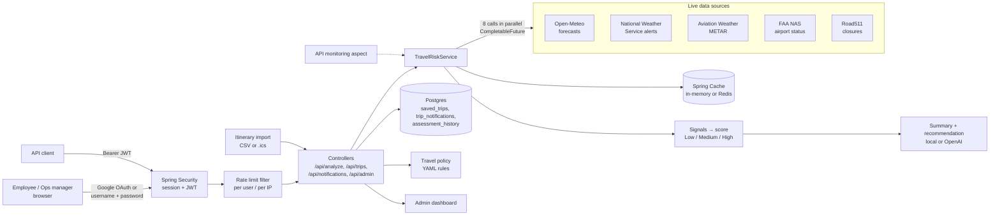
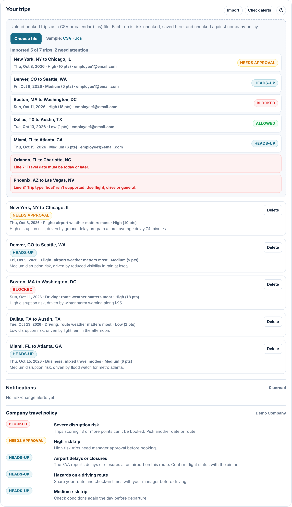
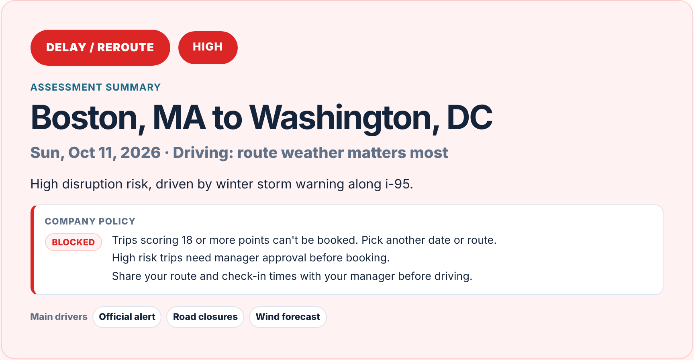

# Travel Risk Platform

**Know which trips are at risk before they're disrupted, and why.** Travel Risk Platform gives a company's travel or operations team one score per trip, built from live weather, official alerts, airport delays and road closures, with the evidence attached. It saves trips and flags them when the risk changes, so the team can move a trip the day before instead of rescuing a stranded employee the day of.

**Code:** [github.com/jordanamao/travel-risk-platform](https://github.com/jordanamao/travel-risk-platform) · **Live app:** [travel-risk-platform.onrender.com](https://travel-risk-platform.onrender.com) (demo login [below](#production-application)) · **Demo script:** [docs/DEMO_SCRIPT.md](docs/DEMO_SCRIPT.md)

## Case Study

### The problem

Every company that sends people on the road pays for disruptions it could have seen coming:

- **Missed meetings and lost deals** when a client visit falls through because a flight was ground-stopped.
- **Stranded employees** and the scramble that follows: hotels, rebooking fees, a day of lost work.
- **Duty of care.** Employers are expected to know when their travelers are heading into severe weather or a closure, and to act on it. "We didn't check" is not a good answer for HR, legal or the employee's family.

The information to prevent most of this is public, but it's spread across half a dozen sites: forecasts, National Weather Service alerts, FAA airport status, aviation weather reports and state road-closure feeds. No travel desk checks all of them for every trip, so disruptions are found at the airport instead of the day before, when the trip could still be moved.

### Who it's for

- **The buyer: a corporate travel, operations, or duty-of-care / HR lead** responsible for people on the road. They need one view of every employee's upcoming trips, which ones are at risk, what changed since yesterday, and a record that the company checked.
- **The everyday user: employees** who want a fast "should I leave earlier or pick another day?" answer for their own trip, without seeing anyone else's.

### The value

- **Minutes per trip down to seconds.** Checking forecasts at both ends, NWS alerts, airport weather, FAA status and road closures by hand takes an estimated 10 to 15 minutes per trip; the app does all eight checks in one click, in seconds. *(Estimate based on visiting each source manually.)*
- **Fewer surprise disruptions.** Saved trips are rechecked and raise an alert when the risk level changes, so a trip booked on a calm Monday gets flagged when a storm shows up on Thursday.
- **Decisions people can defend.** Every score lists the signals and sources behind it, so a manager can explain a "move this trip" call to the traveler, their boss or an auditor.
- **A duty-of-care record.** Assessments are stored with their timestamp, giving the company a history of what it knew and when.

### What it does

- **One risk score per trip, with the receipts.** A route and date go in; out comes Low / Medium / High, a points total, a confidence level, a plain-English summary and recommendation, and every signal and source that produced it. Operators can see *why*, not just a color.
- **Eight live checks in parallel.** Forecasts at the origin, destination and route midpoint (Open-Meteo), NWS alerts at both ends, METAR airport weather, FAA NAS ground stops and delay programs, and Road511 closures.
- **Plugs into the customer's own data.** Upload the booking export or calendar the company already has (CSV or .ics) and every trip is risk-checked and saved, with a per-row result so one bad row never blocks the rest.
- **The customer's travel policy, as config.** A YAML rules file decides whether each trip is *Allowed*, needs a *Heads-up*, *Needs approval* or is *Blocked* (for example "High risk trips need manager approval"), so each company sets its own rules without a code change.
- **Saved trips and alerts.** Employees save trips; a recheck compares the new score with the saved one and creates a notification when the risk level moves.
- **An admin dashboard** with every employee's trips and their policy result, high-risk counts, recent assessments, and API monitoring (call counts, failures, slow calls).
- **Production basics:** Google OAuth plus JWT for API clients, role-based access (employees only see their own data, `/api/admin/**` is admin-only), Postgres with Flyway migrations, caching, per-user rate limiting, a consistent `{"error": "..."}` error contract, health checks, CI on every push, and auto-deploy to Render from `main`.

### Architecture



**How the score works.** Each source turns its raw data into zero or more *signals* with a severity. Severities are worth points (low 1, medium 3, high 6; aviation weather gets +1 on flights), the points add up, and the total maps to a level: **10+ is High, 5 to 9 is Medium, under 5 is Low**. Every signal is shown next to the score, so an operator can disagree with it on the evidence.

### Key trade-offs

| Decision | Why | What it costs |
| --- | --- | --- |
| Free, public data sources (no paid flight-status API) | Anyone can run it without contracts or keys; good enough to catch weather, ground stops and closures | No airline-specific delays or a booked flight's own status yet |
| Transparent additive points instead of an ML model | Operators need to see and trust *why* a trip is High; there's no labeled disruption history to train on | Weights are hand-tuned and need guarding against double counting (see below) |
| Fan out all sources in parallel, and degrade per source | One slow or down API shouldn't block or fail the whole check; a failed source shows as "could not be reached" | The score can be lower than reality when a source is down, so source status is shown on every result |
| Cache assessments per route and date | External APIs are slow and rate limited; repeat checks are instant | Results can be up to the cache TTL old; there's an explicit refresh endpoint |
| In-memory rate limits and monitoring counters | No extra infrastructure for a single instance | Reset on restart and aren't shared across instances; Redis is the next step |
| Travel policy as a YAML file, checked at startup | Each customer gets their own rules without a code change; a typo stops the app from starting instead of silently skipping a rule | A policy change needs a restart; there's no in-app policy editor yet |
| Local summary fallback, OpenAI optional | The app works with no AI key and no AI cost | Fallback summaries are template-based |

### A real bug: one road closure feed made a flight "High risk"

While testing the live site, a **New York to San Francisco flight scored High (60 points)**. Nothing was wrong with the weather or the airports. The cause was Road511: it returns *statewide* events, and every California road event, including routine work zones and one event listed twice, became its own 6-point "high" signal. Ten road events were worth 60 points on a trip that never touches a road, and the summary repeated "live road closure or traffic incident data" three times.

**How I fixed it** ([PR #14](https://github.com/jordanamao/travel-risk-platform/pull/14)):

1. **Roll up and dedupe.** All Road511 events for a check become *one* road-conditions signal, deduplicated by title, with severity from the worst closure type (full closure is high, closure or incident is medium, anything else is low).
2. **Score by travel mode.** Flight trips keep road data as evidence but leave it out of the score, because a road closure doesn't delay a flight.
3. **Name each driver once.** The summary and recommendation now follow the real drivers, without repeats.
4. **Lock it in with tests** for the rollup, the dedupe, the severity mapping, and the flight-mode exclusion.

**Result:** the same New York to San Francisco flight now scores **Low (0 points)**, and a *driving* trip with the same closures scores **Medium (6 points)**, which is what a person looking at the map would say.

**What it taught me:** with an additive score, the unit of counting matters as much as the weights. A source that returns many rows about one condition has to be collapsed to one signal, and a signal only counts if it can actually affect the way the person is traveling.

### Results

- **8** live checks per assessment, run in parallel, with per-source status shown on every result.
- **3-level** risk score with points, confidence, evidence and a recommendation.
- **60 → 0 points** on the NY to SF flight after the road-closure fix (High → Low), with the driving case still correctly flagged Medium.
- **52** automated tests run in CI on every push and pull request; `main` requires Maven tests and a Docker build to pass before merge.
- Deployed on Render with managed Postgres and three Flyway-managed tables, auto-deployed from `main`.

### Rolling it out at a company

1. **Sign in with your company accounts.** Google sign-in works out of the box; admins are set by configuration, and employees only ever see their own trips.
2. **Bring in the trips you already book.** Upload the travel agency's CSV export or a calendar file. Common column-name and date variations are accepted, because every customer's export is a little different. Admins can import for the whole company.
3. **Set your own policy.** Point `TRAVEL_POLICY_LOCATION` at the company's rules file. [`samples/acme-travel-policy.yml`](samples/acme-travel-policy.yml) is a stricter example: approval for anything above Low risk and no driving into an active weather alert.
4. **Run the travel desk from the admin dashboard.** Upcoming trips across the company with their policy result, high-risk counts, unread alerts and data-source health in one place.
5. **Grow from there:** airline-specific operations and a booked flight's live status, and pushing alerts to the channels the team already uses.

## Production Application

- Live app: [https://travel-risk-platform.onrender.com](https://travel-risk-platform.onrender.com)
- Login page: [https://travel-risk-platform.onrender.com/login](https://travel-risk-platform.onrender.com/login)
- Employee demo logins: any `employee` plus a number at `email.com`, such as `employee1@email.com`, `employee5@email.com`, or `employee100@email.com` / `travel-risk-demo` (or click **Use demo account** on the login page)
- Admin login: set `TRAVEL_RISK_ADMIN_USERNAME` and `TRAVEL_RISK_ADMIN_PASSWORD` (never shared)

The production deployment runs on Render with a managed Render Postgres database. Saved trips are persisted in the `saved_trips` table, and risk-change notifications are persisted in the `trip_notifications` table.

## Screenshots

### Login


### Risk Result


### Admin Dashboard


### Itinerary Import



### Policy Result



## Run Locally

```bash
mvn spring-boot:run
```

Then open `http://localhost:8080`.

## Deploy And Test

**Production branch: `main`.** Render auto-deploys every merge to `main` to [travel-risk-platform.onrender.com](https://travel-risk-platform.onrender.com). Nothing else deploys. `develop` and feature branches never reach production.

**`main` is protected.** A pull request can only merge when both required checks pass:

- **Maven Tests:** `mvn test` on Java 21 (all unit and integration tests).
- **Docker Build:** `docker build`, the same image Render runs.

GitHub Actions runs both on every push and pull request ([`.github/workflows/ci.yml`](.github/workflows/ci.yml)).

**Run the tests from a fresh checkout.** You need Java 21 and Maven 3.9+. No database, API keys, Google credentials or `.env` file are needed: tests use an in-memory database and a placeholder Google client id.

```bash
git clone https://github.com/jordanamao/travel-risk-platform.git
cd travel-risk-platform
mvn test
```

Expected result: `Tests run: 52, Failures: 0, Errors: 0` and `BUILD SUCCESS` (verified on a fresh clone of `main` on 2026-10-06).

**Health check:** `GET /health` returns `{"status":"UP"}`; Render uses it to decide when a new deploy is live.

## Optional AI Summary

The platform works without an OpenAI key by using a local summary fallback. To enable OpenAI-generated summaries:

```bash
export OPENAI_API_KEY=your_key_here
export OPENAI_MODEL=gpt-6-astra
```

## Authentication

The dashboard is protected by Spring Security. Employee users can only see their own saved trips and notifications. Admin users can also see the company-wide dashboard, assessment history, and API monitoring views.

For local demos, sign in as an employee with any `employee` plus a number at `email.com`, such as `employee1@email.com`, `employee5@email.com`, or `employee100@email.com` / `travel-risk-demo`. The **Use demo account** button on the login page fills these in for you. Configure an admin account with:

```bash
export TRAVEL_RISK_EMPLOYEE_USERNAME_PATTERN='employee[0-9]+@email\.com'
export TRAVEL_RISK_PASSWORD=your-password
export TRAVEL_RISK_ADMIN_USERNAME=your-admin-user
export TRAVEL_RISK_ADMIN_PASSWORD=your-strong-admin-password
export TRAVEL_RISK_JWT_SECRET=replace-with-at-least-32-characters
```

API clients can request a JWT:

```bash
curl -X POST http://localhost:8080/api/auth/token \
  -H "Content-Type: application/json" \
  -d '{"username":"employee1@email.com","password":"travel-risk-demo"}'
```

Then call protected endpoints with `Authorization: Bearer <token>`.

OAuth2 login is supported through Google. Create a Google OAuth client for a web application and add this redirect URI:

```text
http://localhost:8080/login/oauth2/code/google
```

Then create a local `.env` file:

```properties
GOOGLE_CLIENT_ID=your-google-client-id
GOOGLE_CLIENT_SECRET=your-google-client-secret
```

The `.env` file is ignored by Git. Start the app with:

```bash
mvn spring-boot:run
```

The login page will use `/oauth2/authorization/google` for Google sign-in.

## Admin Dashboard

**Access:** set `TRAVEL_RISK_ADMIN_USERNAME` and `TRAVEL_RISK_ADMIN_PASSWORD` (both are required; changes apply on restart), then sign in with those credentials on `/login`. The dashboard appears on the main page only for that account. Employee and Google sign-ins never see it, and `/api/admin/**` returns `403` for them.

**What it shows** (`GET /api/admin/dashboard`):

- Totals: saved trips, employees with saved trips, high-risk trips, unread alerts, and assessment history records.
- Every employee's saved trips, ordered by travel date, with risk level and summary.
- The 10 most recent trip assessments across all users. **Clear history** (`DELETE /api/admin/assessment-history`) deletes all of them and can't be undone.
- API monitoring: call counts, failures and slow calls (at or above `SLOW_API_THRESHOLD_MS`, default 1500 ms), plus the last 25 slow or failed calls. These counters are in memory and reset on restart.

## Itinerary Import And Travel Policy

Companies already have their trips somewhere: a travel agency's booking export or a calendar. Instead of retyping each trip, a traveler (or an admin, for the whole company) uploads that file and every trip is risk-checked, saved, and checked against the company's travel policy.

**Import** (`POST /api/trips/import`, multipart field `file`, or **Import** in *Your trips*):

- **CSV** with a header row. Columns: `traveler_email, origin, destination, date, trip_type, origin_airport, destination_airport`. Only origin, destination and date are required. Common header variations (`From`, `Travel Date`, `Mode`, ...) and `MM/DD/YYYY` dates are accepted, because every customer's export is a little different.
- **Calendar (.ics)**. Each event is one trip: `DTSTART` is the date, the title reads like `Flight: New York, NY (JFK) to Chicago, IL (ORD)`, and the first `ATTENDEE` email is the traveler. `X-TRAVEL-ORIGIN`, `X-TRAVEL-DESTINATION` and `X-TRAVEL-MODE` override the title.
- Every row gets its own result. A bad row (a past date, an unknown trip type, a duplicate) is reported with its line number and never blocks the rest of the file.
- Employees can only import their own trips; rows for someone else are skipped. Admins can import for any traveler.
- Up to 25 trips and 256 KB per file (`ITINERARY_IMPORT_MAX_ROWS`). Dates must fall inside the 15-day forecast window.
- `GET /api/trips/import/sample?format=csv|ics` downloads a sample dated from today. The copies in [`samples/`](samples/) are dated from 2026-10-06, so download a fresh one (or edit the dates) before importing them.

**Travel policy.** Rules live in a YAML file, not in code, so each customer can have their own. The default is [`src/main/resources/travel-policy.yml`](src/main/resources/travel-policy.yml); point `TRAVEL_POLICY_LOCATION` at another file to swap it, for example `TRAVEL_POLICY_LOCATION=file:samples/acme-travel-policy.yml`.

```yaml
- id: high-risk-approval
  name: High risk trip
  action: require_approval     # allow, warn, require_approval or block
  when:
    minRiskLevel: High         # also: riskLevels, minPoints, modes, signalTypes
  message: High risk trips need manager approval before booking.
```

- Every matching rule is listed on the trip, and the strictest action decides the result: *Allowed*, *Heads-up*, *Needs approval* or *Blocked*.
- The result shows on the assessment, on each saved trip, and in a **Policy** column on the admin dashboard. `GET /api/policy` returns the active rules and `POST /api/policy/evaluate` checks an unsaved assessment.
- Decisions are worked out when a trip is read, so a policy change applies to every saved trip after a restart.
- The app checks the file at startup and refuses to start on a typo (unknown action, misspelled condition, duplicate id), rather than silently ignoring a rule.

## Error Responses

Every API error returns the same JSON shape with an HTTP status code:

```json
{ "error": "Origin is required. Date is required." }
```

`400` means invalid input, `401` not signed in, `403` not an admin, `404` the saved trip or notification doesn't exist, `429` rate limited, and `500` an unexpected server error (details go to the server log, not the response).

## Rate Limiting

In-process, fixed-window rate limiting protects two endpoints. Over the limit, the API returns `429` with a `Retry-After` header (seconds) and `{"error": "..."}`, and the request never reaches the controller.

- `GET /api/analyze`: per authenticated user (JWT subject / session user); falls back to client IP when unauthenticated.
- `POST /api/auth/token`: per client IP, stricter, to slow down password guessing.

| Property (env var) | Default | Meaning |
| --- | --- | --- |
| `travel-risk.rate-limit.enabled` (`RATE_LIMIT_ENABLED`) | `true` | Set `false` to disable rate limiting entirely |
| `travel-risk.rate-limit.analyze.requests` (`RATE_LIMIT_ANALYZE_REQUESTS`) | `30` | Analyze requests allowed per window |
| `travel-risk.rate-limit.analyze.window` (`RATE_LIMIT_ANALYZE_WINDOW`) | `60s` | Analyze window length (e.g. `60s`, `2m`) |
| `travel-risk.rate-limit.token.requests` (`RATE_LIMIT_TOKEN_REQUESTS`) | `10` | Token requests allowed per IP per window |
| `travel-risk.rate-limit.token.window` (`RATE_LIMIT_TOKEN_WINDOW`) | `60s` | Token window length |

Counters are kept in memory per application instance and reset on restart. Behind a reverse proxy (such as Render), set `server.forward-headers-strategy=native` so the client IP is taken from `X-Forwarded-For` instead of the proxy address.

## Redis Cache

Repeated trip assessments are cached through Spring Cache. Local development uses the in-memory cache by default. To use Redis, run Redis locally or in production and start the app with:

```bash
export SPRING_CACHE_TYPE=redis
export REDIS_HOST=localhost
export REDIS_PORT=6379
export REDIS_CACHE_TTL=10m
mvn spring-boot:run
```

Cache behavior:

- `GET /api/analyze` uses `@Cacheable` to reuse matching route/date assessments.
- `POST /api/analyze/cache/refresh` uses `@CachePut` to recompute and replace one cached assessment.
- `DELETE /api/analyze/cache` uses `@CacheEvict` to remove one cached assessment.

## SQL Saved Trips

Saved trips are stored in SQL through Spring Data JPA and Flyway migrations. Local development uses an H2 database file at `./data/travel-risk` by default, while production should use a managed Postgres database.

The included `render.yaml` creates a Render Postgres database named `travel-risk-platform-db` and passes its connection string to the web service as `DATABASE_URL`. The Docker entrypoint converts Render's `postgresql://...` URL into the JDBC settings Spring Boot expects.

To connect Postgres, set JDBC environment variables before starting the app:

```bash
export JDBC_DATABASE_URL=jdbc:postgresql://host:5432/travelrisk
export JDBC_DATABASE_USERNAME=travelrisk
export JDBC_DATABASE_PASSWORD=your-password
export JPA_DDL_AUTO=validate
mvn spring-boot:run
```

Flyway creates the `saved_trips` table on first startup. Hibernate then validates the schema instead of changing it at runtime.

Saved trip endpoints:

- `GET /api/trips` lists trips for the signed-in user.
- `POST /api/trips` saves the current assessment snapshot.
- `DELETE /api/trips/{id}` removes one saved trip owned by the signed-in user.
- `POST /api/trips/alerts/check` rechecks saved trips and creates a notification when risk changes.
- `GET /api/notifications` lists risk-change notifications for the signed-in user.
- `POST /api/trips/import` imports a CSV or .ics itinerary (see [Itinerary Import And Travel Policy](#itinerary-import-and-travel-policy)).

## Deploy To Render

This app can deploy to Render as a Docker web service. The included `render.yaml` uses the Dockerfile and keeps secrets out of Git.

Current production URL:

```text
https://travel-risk-platform.onrender.com
```

Render resources:

- Web service: `travel-risk-platform`
- Postgres database: `travel-risk-platform-db`
- Database name: `travelrisk`
- Database tables: `saved_trips`, `trip_notifications`, `flyway_schema_history`

Required Render environment variables:

```text
TRAVEL_RISK_JWT_SECRET
GOOGLE_CLIENT_ID
GOOGLE_CLIENT_SECRET
DATABASE_URL
SPRING_CACHE_TYPE=simple
```

Optional:

```text
OPENAI_API_KEY
OPENAI_MODEL=gpt-6-astra
ROAD511_API_KEY
```

`ROAD511_API_KEY` enables live road incident and closure checks. The FAA NAS airport status feed does not require an API key.

After Render gives you a public URL, add its Google OAuth redirect URI in Google Cloud:

```text
https://your-render-domain.onrender.com/login/oauth2/code/google
```

If you add a custom domain later, also add:

```text
https://your-custom-domain.com/login/oauth2/code/google
```

## Data Sources

- OpenStreetMap Nominatim for geocoding
- Open-Meteo for forecasts
- National Weather Service for official alerts and forecasts
- Aviation Weather Center for METAR airport observations
- FAA NAS Status API for live airport ground stops, delay programs, arrival/departure delays, and closures
- Road511 Traffic Data API for road incidents and closures when `ROAD511_API_KEY` is configured
